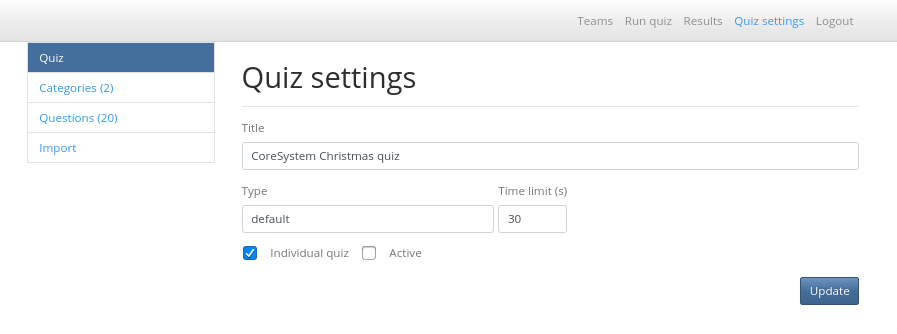
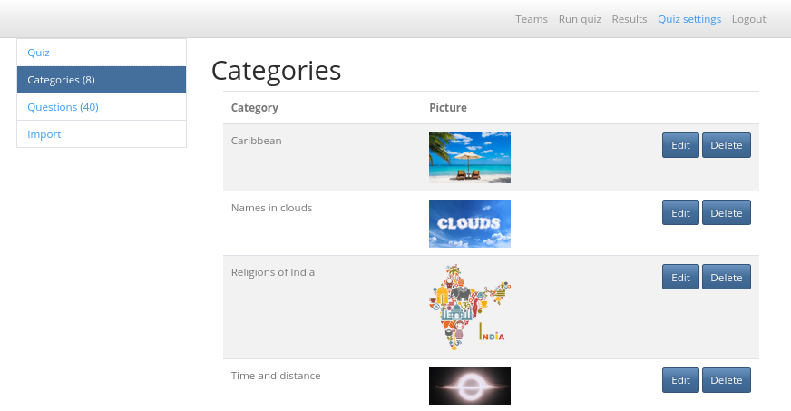
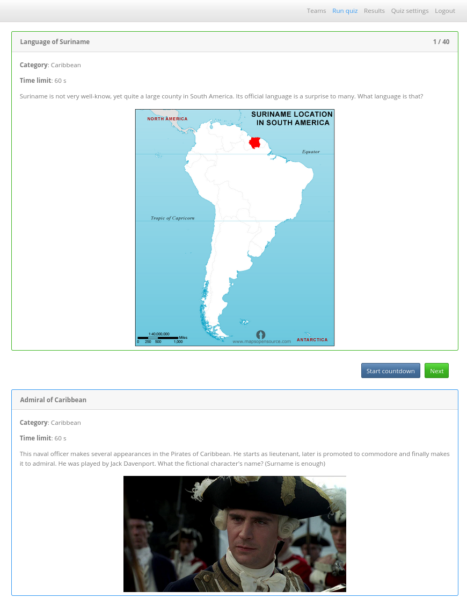
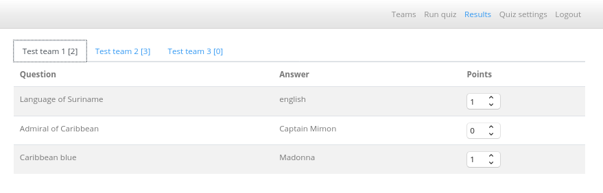
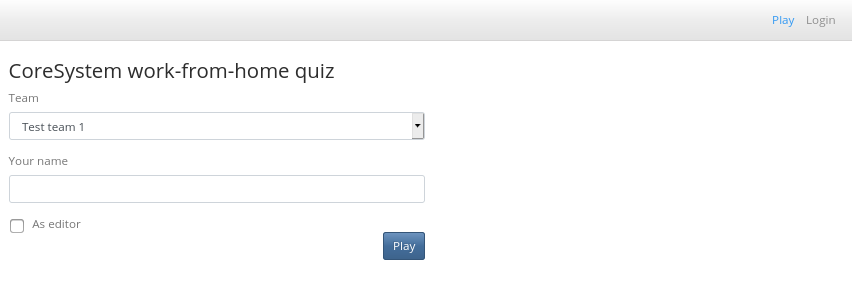
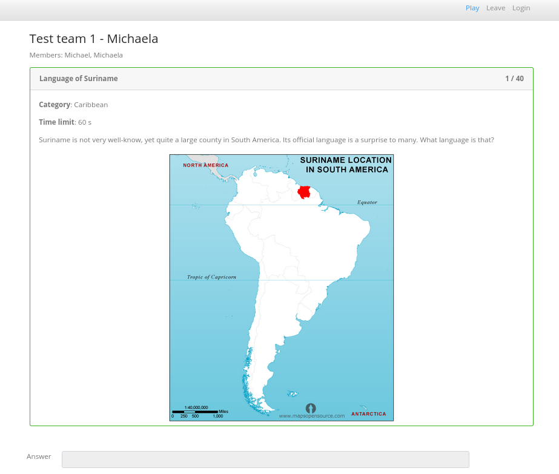

# Installing
## Apache setting
```
<VirtualHost *:80>

    WSGIScriptAlias /virt-pubquiz /var/www/wsgi-scripts/virt-pubquiz/virt-pubquiz.wsgi

    <Directory /var/www/wsgi-scripts>
        <IfVersion < 2.4>
            Order allow,deny
            Allow from all
        </IfVersion>
        <IfVersion >= 2.4>
            Require all granted
        </IfVersion>
    </Directory>
</VirtualHost>
```

## SeLinux
```
# semanage fcontext -a -t httpd_sys_rw_content_t "/var/www/wsgi-scripts/virt-pubquiz/virt_pubquiz/files(/.*)?"
# restorecon -v /var/www/wsgi-scripts/virt-pubquiz/virt_pubquiz/files
```

# How to use it
## Admin view
Quiz settings - quiz can be imported here.





Run quiz



Teams results



## Player view
Register as a team player



And play :)



# Import quiz
You can prepare a quiz as a github project and clone it to pubquiz machine. Then it will appear in option to import the quiz.
## Github project 
Project structure
```
pictures/
questions/
quiz.yaml
```

quiz.yaml format
```
---
title: My pubquiz
type:
  name: default
  option:
    random_order: false
    categories:
      - name: Cateogry 1
        picture: category1.jpg
        questions:
          - question1.yaml
          - question2.yaml
time_limit: 50
```

question YAML format
```
---
title: Question 1
type:
  name: open
picture: question1.jpg
task: |
  Some description.
  Some question?
answer: answer
time_limit: 60
```

